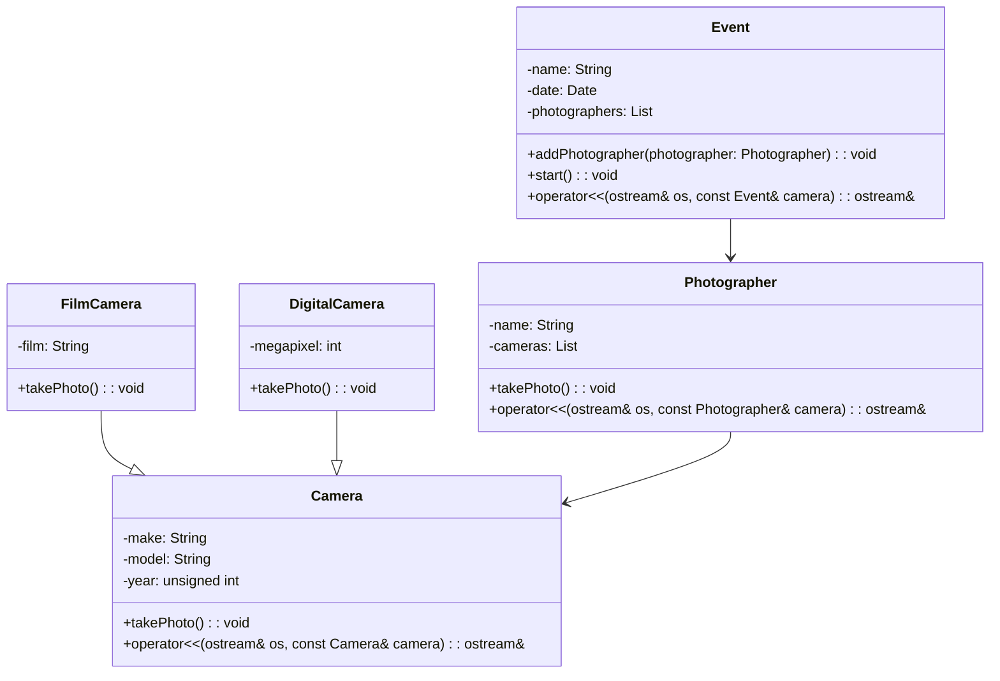

Hinweis: Zum Anzeigen in Clion das Plugin 'Mermaid' installieren oder den UML Code in https://mermaid.live/ kopieren. 

```mermaid
classDiagram
class Camera {
    -make: String
    -model: String
    -year: unsigned int
    +takePhoto(): void
    +operator<<(ostream& os, const Camera& camera): ostream&
}

class FilmCamera {
    -film: String
    +takePhoto(): void
}

class DigitalCamera {
    -megapixel: int
    +takePhoto(): void
}

class Photographer {
    -name: String
    -cameras: List<Kamera>
    +takePhoto(): void
    +operator<<(ostream& os, const Photographer& camera): ostream&
}

class Event {
    -name: String
    -date: Date
    -photographers: List<Photographer>
    +addPhotographer(photographer: Photographer): void
    +start(): void
    +operator<<(ostream& os, const Event& camera): ostream&
}

FilmCamera --|> Camera
DigitalCamera --|> Camera
Photographer --> Camera
Event --> Photographer
```